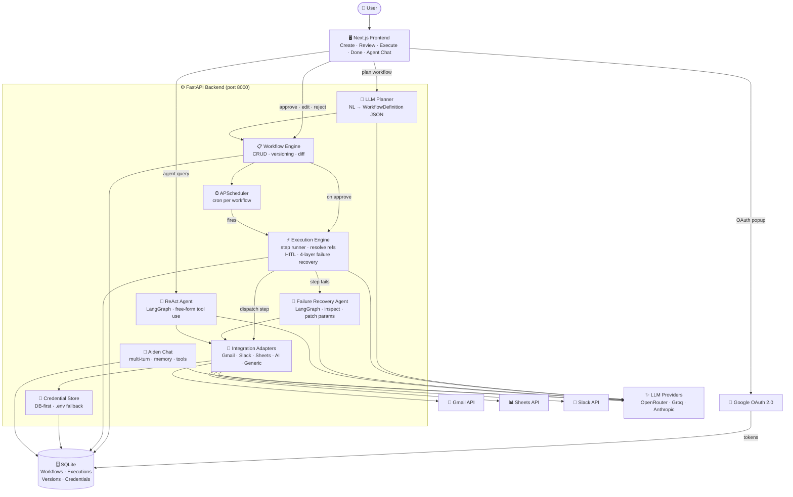
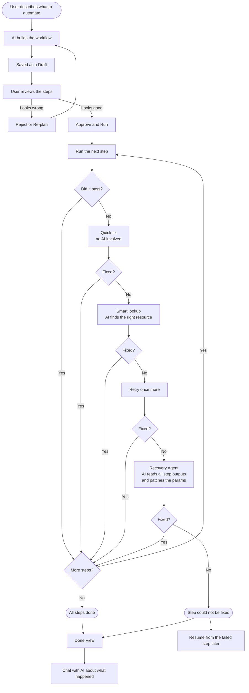

# FlowForge — AI Workflow Automation Platform

FlowForge lets you describe a multi-step automation in plain English and turns it into a structured, reviewable, executable workflow. It connects Gmail, Slack, and Google Sheets through an LLM-powered planner, a live execution engine, a LangGraph ReAct agent, and a conversational chat assistant — all from a single Next.js UI.

---
# Demo Video 


https://github.com/user-attachments/assets/3ecbe1af-69b4-4c04-90e4-ae045eb6e9ac


## Table of Contents

1. [Features](#features)
2. [Architecture Overview](#architecture-overview)
3. [Component Deep-Dive](#component-deep-dive)
4. [Key Design Decisions](#key-design-decisions)
5. [Assumptions](#assumptions)
6. [Tradeoffs](#tradeoffs)
7. [Setup Guide](#setup-guide)
8. [Environment Variables](#environment-variables)
9. [API Reference](#api-reference)
10. [Future Improvements](#future-improvements)

---

## Features

| Category | Capability |
|---|---|
| **Workflow planning** | Natural language → structured multi-step workflow via LLM |
| **Review & approval** | Draft → review → approve/reject lifecycle before any execution |
| **Query-driven replan** | Edit the automation description and click Re-plan to regenerate the entire workflow in one click |
| **Execution engine** | Step runner with per-step retry, rate-limit backoff, and 4-layer failure recovery |
| **Step-output chaining** | `${step_N.field}` references pass outputs between steps at runtime |
| **Cancel & resume** | Stop a running execution at any step boundary; resume it later from where it stopped |
| **LangGraph agent** | Free-form ReAct agent for dynamic tool use (separate from the planner) |
| **Failure recovery** | Second LangGraph agent auto-patches steps that fail during execution |
| **Version history** | Full workflow snapshots with structured diff on every save |
| **Scheduled runs** | Cron-based scheduling via APScheduler; toggle per-workflow |
| **Execution chat** | Post-run LLM chat contextualised with step results |
| **Workflow chat** | In-review chat to refine steps conversationally |
| **Chat assistant** | Aiden — a general-purpose multi-turn assistant with memory and tools |
| **Integration management** | Google OAuth popup + Slack token UI; credentials stored in DB |

---

## Architecture Overview

FlowForge has three layers: a **Next.js frontend**, a **FastAPI backend**, and **external services** (LLM providers + Google/Slack APIs). All communication between frontend and backend is REST/JSON.


### Layers at a glance

| Layer | Tech | Responsibility |
|---|---|---|
| Frontend | Next.js (App Router) + TypeScript | Workflow creation, review, live execution view, version history, agent chat, Aiden assistant |
| Backend | FastAPI + SQLAlchemy + SQLite | LLM planning, step execution, failure recovery, scheduling, integrations, chat |
| LLM providers | OpenRouter / Groq / Anthropic | Workflow planning, AI tools (summarize/extract/transform), LangGraph agents |
| External APIs | Gmail API · Slack API · Google Sheets API | Integration step execution |

### Backend subsystems

```
API Routers
  ├── /api/workflows    → LLM Planner → WorkflowDefinition JSON
  ├── /api/executions   → Execution Engine (step runner + 4-layer recovery)
  ├── /api/agent/runs   → LangGraph ReAct Agent (free-form tool use)
  ├── /api/chat         → Aiden Chat Assistant (multi-turn + memory)
  └── /api/integrations → OAuth + token management

Execution Engine
  └── for each step: resolve refs → call adapter → recover on failure → log

Integration Adapters (self-registering via IntegrationRegistry)
  └── gmail · slack · sheets · ai_tools · generic

LangGraph (3 uses)
  ├── agentic_runner.py  — ReAct agent for /api/agent/runs
  ├── failure_agent.py   — step repair after retries exhausted
  └── base.py inline     — per-adapter resource discovery on dispatch error

Persistence
  └── SQLite:  Workflow · Execution · ExecutionLog · WorkflowVersion
               AgentRun · AgentStep · IntegrationCredential
```

### System architecture



---

### Workflow lifecycle



---

## Component Deep-Dive

### Backend

#### `app/main.py` — App factory

`FastAPI` instance with CORS middleware. Uses a lifespan context manager to:
1. Call `init_db()` — creates tables and runs `_migrate_schema()` for column additions
2. Call `_reset_stuck_executions()` — marks any `"running"` executions left from a prior hard-kill as `"failed"`
3. Start APScheduler and re-register all schedule-enabled workflows

All routers are registered at startup (`/api/workflows`, `/api/executions`, `/api/agent/runs`, `/api/chat`, `/api/memory`, `/api/integrations`).

---

#### `app/core/config.py` — Settings

All configuration is read from `backend/.env` via Pydantic `BaseSettings`. The `get_settings()` function is decorated with `@lru_cache` so the file is only parsed once per process — a server restart is required after any `.env` change.

---

#### `app/database.py` — Schema management

Uses SQLAlchemy `Base.metadata.create_all()` for initial table creation and a `_migrate_schema()` helper that runs `ALTER TABLE … ADD COLUMN` statements through `PRAGMA table_info` introspection. This avoids Alembic while still supporting live schema evolution.

On every startup, `_reset_stuck_executions()` finds any `Execution` rows still in `"running"` state (left over from a hard kill) and marks them `"failed"` with an explanatory message.

---

#### `app/workflow/planner/llm_planner.py` — Workflow Planner

Converts a plain-English description into a `WorkflowDefinition` (name, trigger, and steps list). The system prompt is built **dynamically** each call via `_build_system_prompt()` which queries `IntegrationRegistry` for live integration specs, available actions, configured resource IDs, and chaining guidance — so adding a new integration automatically updates the prompt without touching any static string.

`_build_chaining_section(specs)` assembles the multi-step chaining guidance block at call time from three sources:
1. `PLANNER_CHAINING_SYNTAX` from `prompts.py` — engine-level syntax rules (`${step_N.field}` numbering, array shortcuts, `${today}`/`${now}`)
2. `spec["planner_notes"]` from each integration — integration-specific rules (e.g. "only add Slack step when user explicitly asks")
3. `spec["chaining_examples"]` from each integration — step-by-step multi-step patterns contributed by each adapter

This means chaining examples are always consistent with the actual integration code — each adapter owns its own patterns.

Dispatches on `AI_PROVIDER`:
- `"openrouter"` (default) — OpenAI-compatible client pointed at `https://openrouter.ai/api/v1`
- `"groq"` — `AsyncGroq` client
- `"anthropic"` — `AsyncAnthropic` client

Output is parsed by `_parse_llm_output`: strips markdown fences, validates JSON, checks integrations against the registry, and normalises action names (strips `gmail.` prefix if the model included it). Unknown integrations are automatically rerouted through `generic` rather than failing hard.

---

#### `app/workflow/engine/execution_engine.py` — Execution Engine

Runs workflow steps sequentially in a FastAPI `BackgroundTask`. Before each step:

1. **`_resolve_params`** walks the step's params dict and replaces `${step_N.field}` references with outputs from prior steps. Two-pass approach handles both whole-value references (which arrive as Python objects) and inline string interpolation.
2. **`_assert_no_unresolved_refs`** validates that all `${step_N.*}` references were resolved — never false-positives on bare `${variable}` in email bodies.
3. The step is dispatched to the matching integration adapter via `IntegrationRegistry`.
4. On failure: 4-layer recovery (see below).
5. At the start of each step, the engine calls `db.refresh(execution)` to detect a `"cancelled"` status written by `POST /api/executions/{id}/cancel`.

A `ExecutionLog` row is written for every step regardless of outcome.

**4-layer failure recovery (in order):**

| Layer | Mechanism | Cost |
|---|---|---|
| 1 | `BaseIntegration._recover_fixable()` — pure-Python fix per adapter (re-search inbox, fuzzy-match tab name) | Zero LLM cost |
| 2 | `BaseIntegration._run_recovery_agent()` — inline LangGraph `StateGraph` scoped to the adapter; uses integration discovery tools (e.g. `list_channels`) | 1–2 LLM calls |
| 3 | Engine retry — `MAX_RETRIES = 1` raw re-attempt | Zero LLM cost |
| 4 | `failure_agent.py` — full LangGraph ReAct agent with 3 tools; skipped for rate-limit errors | 2–4 LLM calls |

**Resume / cancel support:**
- `cancel_execution()` sets `status = "cancelled"` in the DB; the background task detects it at the next step boundary and stops cleanly, preserving `current_step`.
- `create_execution_from_step()` seeds prior step outputs from the most recent successful run so that `${step_N.field}` references still resolve correctly when restarting partway through.

---

#### `app/workflow/integrations/base.py` — Integration abstraction

`BaseIntegration` defines the contract every adapter must satisfy:

| Method | Required | Purpose |
|---|---|---|
| `_dispatch(action, params)` | Yes | Route action string to the correct handler |
| `_classify_error(exc)` | No | Map exceptions to `ErrorCategory` |
| `_recover_fixable(action, params, exc)` | No | Pure-Python fix before the LLM agent is invoked |
| `_get_recovery_tools()` | No | `@tool`-decorated discovery functions the LangGraph agent may call |
| `get_agent_tools()` | No | LangChain tools exposed to the ReAct agent |
| `get_planner_spec()` | No | Structured spec for dynamic planner prompt construction |
| `get_configured_resources()` | No | `(label, value)` pairs injected into the planner prompt |

`IntegrationRegistry` is a class-level registry — each integration calls `IntegrationRegistry.register()` on import. The dynamic planner prompt, agent tool list, and configured-resource display all read from this registry.

When `_recover_fixable()` cannot resolve a dispatch error on its own, `_run_recovery_agent()` builds a scoped `StateGraph` inline — one agent node paired with a `ToolNode` containing the tools from `_get_recovery_tools()`. This is the second LangGraph instantiation (distinct from the standalone ReAct agent and the execution-level failure agent).

---

#### Integration adapters

Only these integrations are registered (`workflow/integrations/__init__.py`): `gmail`, `slack`, `sheets`, `ai`, `generic`.

Each adapter's `get_planner_spec()` now returns three extra keys that feed directly into the dynamic planner prompt:
- `planner_notes` — integration-specific rules the LLM must follow (e.g. when to add an output step, which default values to use)
- `chaining_examples` — list of multi-step patterns with step-by-step `{integration, action, params}` arrays and an optional `note`

**`gmail.py`** — Actions: `search_emails`, `read_email`, `read_emails_batch`, `send_email`, `extract_invoice`, `get_attachments`.
- Authenticates via DB credentials first (OAuth refresh token from the setup UI), then falls back to `.env`.
- Also supports Google Service Account JSON (`GOOGLE_SERVICE_ACCOUNT_JSON`) for Workspace deployments.
- `_recover_fixable` re-searches the inbox when a `message_id` returns 404.
- `extract_invoice` reads an email body and calls the LLM to extract structured invoice fields.
- Contributes 6 chaining examples (search → read → summarize, search → read → extract → append, invoice → Sheets, fan-out to Slack + Sheets, etc.).

**`slack.py`** — Actions: `send_message`, `get_messages`, `create_channel`, `post_notification`, `list_channels`.
- `client` property always does a fresh DB lookup — no caching — so connect/disconnect takes effect immediately without a server restart.
- `_recover_fixable` resolves channel names to IDs when `channel_not_found` is returned.
- `_get_recovery_tools` exposes `list_slack_channels` to the inline recovery agent.
- `planner_notes` encodes the "only add send_message when user explicitly asks for Slack output" rule and the default channel fallback.
- Contributes 2 chaining examples (channel digest → summarize → post, Sheets → post).

**`sheets.py`** — Actions: `read_sheet`, `write_sheet`, `append_row`, `append_rows`, `search_rows`, `get_spreadsheet_info`.
- Same DB-first credential pattern.
- `append_rows` (bulk write) accepts a list of rows to avoid per-row API calls.
- Contributes 2 chaining examples (read Sheets → summarize → Slack, read Sheets → summarize → email).

**`ai_tools.py`** — Actions: `summarize`, `extract`, `transform`.
- Accepts any input type: plain string, list-of-lists (Sheets rows), list-of-dicts (email objects).
- Empty text input returns a graceful result with an explanatory message instead of raising.
- `extract` spreads extracted fields to the top level so `${step_N.amount}` resolves directly without `${step_N.extracted.amount}`.
- `planner_notes` explains the `summary` vs `extracted` field distinction and when to add `ai.summarize`.

**`generic.py`** — HTTP webhooks and manual/placeholder steps. Used for any action that doesn't fit the above adapters.

---

#### `app/workflow/agent/agentic_runner.py` — LangGraph ReAct Agent

A full LangGraph `StateGraph` with a `ToolNode`. Unlike the planner (which generates a fixed plan), this agent:
- Decides which tools to call at runtime based on intermediate results
- Never proactively calls output tools (Slack, email) unless explicitly asked
- Caps tool-call rounds at `MAX_AGENT_STEPS` (default 20)
- Persists every tool invocation as an `AgentStep` row in the DB

The agent is wired to `get_langchain_llm()` from `core/llm.py`, which returns the appropriate LangChain model class based on `AI_PROVIDER`. The system prompt is built dynamically from `AGENT_INTRO` + tool listing grouped by integration prefix.

---

#### `app/workflow/agent/failure_agent.py` — Failure Recovery Agent

Invoked by the execution engine when a step exhausts all retries. Given the failed step, its original params, the error message, and all prior step outputs, this narrowly-scoped LangGraph agent:

1. **`inspect_previous_outputs()`** — returns a truncated (≤5 000 chars) snapshot of all prior step outputs to help the LLM find correct field paths.
2. **`get_config_defaults()`** — returns configured resources from `IntegrationRegistry` (Slack channel, spreadsheet ID, etc.) for resource-not-found errors.
3. **`try_execute_step(params)`** — calls `integration._dispatch()` directly to bypass Layer 2 recovery and avoid infinite nesting.

Rate-limit errors are short-circuited immediately (before building the graph) — there is no point calling the same LLM that just rate-limited the step.

---

#### `app/api/chat.py` + `services/ai_service.py` — Aiden Chat Assistant

A general-purpose multi-turn assistant with:
- Session-scoped conversation history
- Optional memory retrieval from `services/memory_service.py`
- Tool calling via `services/tools_service.py` (currently `datetime_info`; extensible)
- Governed by `CHAT_ASSISTANT_SYSTEM` prompt in `prompts.py`

---

#### `app/prompts.py` — Prompt library

All system prompts live here to make tuning behaviour straightforward without touching business logic:

| Constant | Used by |
|---|---|
| `PLANNER_INTRO` … `PLANNER_OUTPUT_FORMAT` | Workflow planner (assembled by `_build_system_prompt`) |
| `PLANNER_CHAINING_SYNTAX` | Engine-level `${step_N.field}` syntax rules, array shortcuts, `${today}`/`${now}` — inserted as the base of `_build_chaining_section` |
| `AGENT_INTRO` | ReAct agent system prompt prefix |
| `FAILURE_AGENT_SYSTEM` | Failure recovery agent (`failure_agent.py`) |
| `INTEGRATION_RECOVERY_SYSTEM` | Inline per-adapter recovery agent (`base.py`) |
| `EXECUTION_CHAT_SYSTEM` | Post-execution contextual chat |
| `CHAT_ASSISTANT_SYSTEM` | Aiden general chat |

`PLANNER_CHAINING_SYNTAX` contains only engine-level rules — step numbering, array shortcuts (`${step_N.list.first}`), and special date values. Integration-specific patterns and chaining examples are no longer hardcoded here; they live in each adapter's `get_planner_spec()` and are assembled at call time by `_build_chaining_section(specs)` in `llm_planner.py`.

---

#### `app/workflow/engine/workflow_engine.py` — Versioning

- `create_workflow` → saves version 1, `change_summary="Initial creation"`
- `update_workflow` → calls `_compute_diff(old_name, old_json, new_name, new_def)` **before** applying changes, saves a new version after
- `_compute_diff` returns `(str summary, list[dict] changed_fields)` covering: name rename, step added/removed, step renamed, step action changed, step params changed, steps reordered
- `list_versions(db, workflow_id)` → newest first

---

### Frontend

#### `app/page.tsx` — Root page & integration gate

On mount, `Home` fetches `GET /api/integrations/status`. If any integration is disconnected the entire app is replaced with `<IntegrationSetup>` — the workflow UI is never rendered until credentials are present (or the user skips).

Once past the gate, `WorkflowApp` manages a `WfView` discriminated union that drives which panel renders:

```
"create"    → Input form / workflow list sidebar
      ↓  (planWorkflow → creates draft)
"review"    → ReviewView — inspect, modify, approve or reject
      ↓  (Approve & Run → POST /approve with execute=true)
"executing" → ExecutionView — live polling every 1.5 s
      ↓  (execution reaches terminal state)
"done"      → DoneView — summary + resume/run-again + chat
```

Every run — including re-running a saved workflow — routes through `"review"` first. There is no path from the workflow list directly to execution.

---

#### `components/workflow/integration-setup.tsx` — Integration gate

Shown before the main UI when any integration is not connected. Three cards:

- **Gmail** — "Sign in with Google" opens a popup to `GET /api/integrations/google/connect`. The callback posts `{type: "integration_connected"}` via `window.opener.postMessage()`; the setup component listens and re-checks status.
- **Google Sheets** — shares the same Google OAuth flow; connects automatically.
- **Slack** — text input for `xoxb-...` bot token; "Save Token" calls `POST /api/integrations/slack`.

---

#### `components/workflow/review-view.tsx` — Review panel

The central editing surface. Shows the LLM explanation, all steps (via `StepCard`), and action buttons (Approve & Run, Reject, Re-plan). Hosts `WorkflowChat` for conversational step refinement. Modifications call step-level CRUD endpoints; any PUT resets `status` to `"draft"` on the backend.

---

#### `components/workflow/step-card.tsx` — Step display

Read-only step card used in both the review and execution/done views. Shows integration chip, action name, params, and status. In review mode renders edit/delete/reorder controls. In execution mode shows per-step status (pending / running / success / failed / skipped), retry count, and collapsible output/error details from `ExecutionLog`.

---

#### `components/workflow/execution-view.tsx` — Live execution

Polls `GET /api/executions/{id}` and `GET /api/executions/{id}/logs` in parallel every 1 500 ms. Features:
- Per-step status derived from `ExecutionLog` records
- Live warning banner when step errors are detected while the execution is still running
- Top-level failure panel when `ex.status === "failed"`
- Cancelled banner when `ex.status === "cancelled"` with the step number where it stopped
- **Stop button** — calls `POST /api/executions/{id}/cancel`; polling detects `"cancelled"` and transitions to the done view automatically
- `agentFixed` indicator — shown when the failure agent recovered a step mid-run (`⚡ Agent recovered a step`)

---

#### `components/workflow/done-view.tsx` — Post-execution summary

Shows after any terminal state (success, failed, cancelled, or skipped). Displays:
- Result banner with colour-coded icon and execution duration
- Step-by-step results via `StepCard`
- **Resume button** (for failed or cancelled executions) — calls `POST /api/executions/{id}/resume`
- **Run Again button** — re-executes from the beginning
- **Inline chat panel** — contextualised LLM chat about what happened in this run, powered by `POST /api/executions/{id}/chat` which injects the full step results into the system prompt. Steps that initially failed but were recovered by the failure agent are annotated with the original error, so the LLM can explain both what went wrong and how it was fixed

---

#### `components/workflow/step-editor.tsx` — Step editor

`INT_CATALOG` maps each integration to its available actions and default params:

```
gmail  → send_email | read_email | extract_invoice | search_emails | get_attachments
slack  → send_message | get_messages | create_channel | post_notification | list_channels
sheets → append_row | append_rows | read_rows | update_cell | create_sheet | search_rows | get_spreadsheet_info
ai     → summarize | extract | transform
```

Action pills regenerate on integration change; params auto-fill from defaults. Works in both Add (no `step` prop) and Edit (`step` prop) mode.

---

#### `components/workflow/version-history-panel.tsx` — Version history

Fetches all versions newest-first and renders each as a collapsible row:
- Version badge, change summary, timestamp, step count
- Expanded: structured `ChangeRow` items (NAME / ADDED / REMOVED / RENAMED / ACTION / PARAMS / REORDERED pills)
- Expanded: full step snapshot for that version
- PARAMS changes have a toggleable before/after JSON diff panel

---

#### `lib/utils.ts` — Design tokens

All colour, spacing, and typography values are exported as the `C` object. Every component imports and uses `C.*` for inline styles — no CSS framework, no Tailwind classes, no CSS modules.

---

## Key Design Decisions

### 1. LLM planner generates, humans approve

The LLM never triggers execution directly. Every workflow goes through a `draft → review → approved` gate. This prevents LLMs from running destructive or incorrect automations silently and keeps humans in the loop for consequential actions (sending emails, writing to spreadsheets).

### 2. Dynamic prompt construction

The planner system prompt is rebuilt on each call from live `IntegrationRegistry` data rather than being a static string. This means:
- Adding a new integration automatically exposes it to the planner
- Configured resource IDs (spreadsheet, Slack channel) are injected at call time so the LLM uses the actual values, not placeholders
- Chaining examples and action catalogs are always in sync with the real code
- Multi-step patterns (`planner_notes` + `chaining_examples`) are owned by each adapter — adding a new integration means adding its patterns once, in the adapter file, and they immediately appear in the prompt

### 3. Integration registry pattern

All integration adapters self-register on import. The registry is the single source of truth for which integrations exist, what actions they support, what outputs they produce, and which LangChain tools they expose to the agent. No central routing table needs updating when an integration is added.

### 4. Two-pass `${step_N.field}` resolution

Step-output references are resolved in two passes:
- Pass 1 handles whole-value references and preserves Python types (lists, dicts arrive correctly, not as JSON strings)
- Pass 2 handles references embedded inside larger strings

A strict validator after both passes only flags `${step_N.*}` patterns — never bare `${variable}` strings in email bodies.

### 5. Credentials in the database, not `.env`

User integration tokens (Google OAuth, Slack bot token) are stored in the `IntegrationCredential` table. This means:
- Credentials survive server restarts without re-entering them
- Connect/disconnect is instant — the Slack adapter does a fresh DB lookup on every call
- `.env` fallbacks remain for backward compatibility but are optional once the setup UI has been used

### 6. No Alembic — `ALTER TABLE` migrations

Schema evolution is handled by a `_migrate_schema()` function that uses `PRAGMA table_info` to detect missing columns and applies `ALTER TABLE … ADD COLUMN` statements at startup. This keeps the dev experience simple (no migration files to generate or run) while still supporting safe schema changes on existing databases.

### 7. Multi-provider LLM via a single factory

`core/llm.py` abstracts over OpenRouter, Groq, and Anthropic. Any component that needs an LLM calls `chat_complete()` or `get_langchain_llm()` — never imports a provider SDK directly. Switching providers requires only a config change, not code changes.

### 8. Cancel/resume at step boundaries

Cancellation writes `status = "cancelled"` to the DB; the running background task reads this at the start of each step rather than interrupting mid-execution. This guarantees that steps are never torn apart — the execution is always in a consistent state that can be cleanly resumed.

---

## Assumptions

1. **Single-user deployment** — credentials, sessions, and the SQLite database are not partitioned by user. The app is designed for personal or small-team use on a single machine.
2. **SQLite is sufficient** — workflow data volumes are small; no concurrent write contention is expected. Switching to PostgreSQL requires only changing `DATABASE_URL`.
3. **LLM output is trustworthy enough to execute after review** — the system assumes that a human reviewing the generated workflow steps is sufficient validation before execution; it does not sandbox or simulate step execution before running.
4. **Integrations operate on behalf of a single Google/Slack account** — there is one set of stored credentials per integration, not per-user.
5. **Steps are sequential** — the execution engine runs steps one after another. Parallel step execution is not supported.
6. **OpenRouter/Groq/Anthropic network availability** — the planner and agents have no offline fallback (no `USE_MOCK_AI` flag exists in the current config).

---

## Tradeoffs

| Decision | Benefit | Cost |
|---|---|---|
| SQLite over PostgreSQL | Zero-setup, embedded, no extra service | Cannot scale to concurrent multi-user write load |
| No Alembic | No migration file overhead for a single-developer project | `ALTER TABLE` migrations don't support column renames or drops |
| Sequential step execution | Simple mental model, easy chaining, straightforward retry | Long workflows are slow; one slow step blocks everything after it |
| Dynamic system prompt rebuilt each call | Always in sync with real integration state | Adds latency + token cost on every `/api/workflows/` POST |
| Credentials in DB (not `.env`) | UI-driven connect/disconnect; no server restart needed | If DB is lost, all credentials must be re-entered |
| Inline styles only (no CSS framework) | No build-step dependency, design tokens in one file | Verbose JSX, no utility-class composability |
| Approval gate before every execution | Prevents accidental LLM-triggered actions | Adds a mandatory click for users who trust the planner |
| Cancel at step boundary (not mid-step) | Execution always in a consistent, resumable state | A slow step can't be interrupted mid-flight |
| `lru_cache` on settings | Single `.env` parse per process | Config changes require a server restart |

---

## Setup Guide

### Prerequisites

- Python 3.11+
- Node.js 18+
- A Google Cloud project with OAuth 2.0 credentials (for Gmail + Sheets)
- A Slack workspace with a bot token (for Slack)
- An API key for at least one LLM provider: [OpenRouter](https://openrouter.ai), [Groq](https://console.groq.com), or [Anthropic](https://console.anthropic.com)

---

### 1. Clone the repository

```bash
git clone <repo-url>
cd Giridhar_Aiden_AI
```

---

### 2. Backend setup

```bash
cd backend
python -m venv .venv

# Windows
.venv\Scripts\activate

# macOS / Linux
source .venv/bin/activate

pip install -r requirements.txt
```

Create `backend/.env`:

```env
# AI provider (pick one)
AI_PROVIDER=openrouter
OPENROUTER_API_KEY=sk-or-...
OPENROUTER_MODEL=meta-llama/llama-3.3-70b-instruct

# CORS
CORS_ORIGINS=http://localhost:3000

# Google OAuth — create at console.cloud.google.com → APIs & Services → Credentials
GOOGLE_CLIENT_ID=...
GOOGLE_CLIENT_SECRET=...
```

Start the backend:

```bash
python -m uvicorn app.main:app --reload --port 8000
```

The SQLite database (`workflow.db`) is created automatically on first run.

---

### 3. Google OAuth setup

1. Go to [Google Cloud Console](https://console.cloud.google.com) → **APIs & Services** → **Credentials**
2. Create an **OAuth 2.0 Client ID** (Web application type)
3. Add `http://localhost:8000/api/integrations/google/callback` to **Authorized redirect URIs**
4. Enable the **Gmail API** and **Google Sheets API** in **APIs & Services** → **Enabled APIs**
5. Copy the client ID and secret into `backend/.env`

> **Google Workspace / Service Account alternative:** Set `GOOGLE_SERVICE_ACCOUNT_JSON` to the full JSON string of a service account key file and `GMAIL_DELEGATED_USER` to the email to impersonate. Domain-wide delegation must be enabled on the Workspace admin side.

---

### 4. Slack bot setup

1. Go to [api.slack.com/apps](https://api.slack.com/apps) → **Create New App** → From scratch
2. Under **OAuth & Permissions**, add these Bot Token Scopes:
   - `channels:read`, `channels:history`
   - `chat:write`, `chat:write.public`
3. Click **Install to Workspace** and copy the `xoxb-...` bot token
4. Invite the bot to any channels it should post to: `/invite @your-bot-name`
5. The token is entered in the app's integration setup screen (not in `.env`)

---

### 5. Frontend setup

```bash
cd frontend
npm install
```

Create `frontend/.env.local`:

```env
NEXT_PUBLIC_API_URL=http://localhost:8000
```

Start the frontend:

```bash
npm run dev
```

Open [http://localhost:3000](http://localhost:3000).

---

### 6. First run

1. The app shows the **Integration Setup** screen
2. Click **Sign in with Google** — a popup opens, complete the OAuth flow; Gmail and Sheets connect together
3. Enter your Slack `xoxb-...` bot token and click **Save Token**
4. Click **Continue to Workflows →**
5. Type a workflow description in the input box and press Enter (or ⌘↵)
6. Review the generated steps, modify if needed, then click **Approve & Run**

---

## Environment Variables

### Backend (`backend/.env`)

| Variable | Default | Description |
|---|---|---|
| `AI_PROVIDER` | `openrouter` | LLM provider: `openrouter` \| `groq` \| `anthropic` |
| `OPENROUTER_API_KEY` | — | OpenRouter API key |
| `OPENROUTER_MODEL` | `meta-llama/llama-3.3-70b-instruct` | Model to request via OpenRouter |
| `OPENROUTER_BASE_URL` | `https://openrouter.ai/api/v1` | OpenRouter API base URL |
| `GROQ_API_KEY` | — | Groq API key (if `AI_PROVIDER=groq`) |
| `GROQ_MODEL` | `llama-3.3-70b-versatile` | Groq model |
| `ANTHROPIC_API_KEY` | — | Anthropic API key (if `AI_PROVIDER=anthropic`) |
| `CORS_ORIGINS` | `http://localhost:3000` | Comma-separated allowed origins |
| `DATABASE_URL` | `sqlite:///./workflow.db` | SQLAlchemy database URL |
| `GOOGLE_CLIENT_ID` | — | Google OAuth app client ID |
| `GOOGLE_CLIENT_SECRET` | — | Google OAuth app client secret |
| `GOOGLE_REFRESH_TOKEN` | — | Optional `.env` fallback refresh token |
| `GOOGLE_SERVICE_ACCOUNT_JSON` | — | Full JSON string of a service account key (Workspace alternative to OAuth) |
| `GMAIL_DELEGATED_USER` | — | Email to impersonate when using a service account |
| `SLACK_BOT_TOKEN` | — | Optional `.env` fallback Slack bot token |
| `SLACK_DEFAULT_CHANNEL` | `#general` | Default Slack channel |
| `SHEETS_SPREADSHEET_ID` | — | Optional `.env` fallback spreadsheet ID |
| `LLM_TEMPERATURE` | `0.0` | Temperature for all LLM calls |
| `MAX_EXECUTION_RETRIES` | `3` | Backoff attempts for rate-limit errors in integrations |
| `MAX_FIX_ATTEMPTS` | `2` | Max `try_execute_step` calls inside the failure recovery agent |
| `AI_TOOLS_MAX_TOKENS` | `1024` | Max output tokens for summarize/extract/transform |
| `TEXT_INPUT_MAX_CHARS` | `12000` | Max characters of email body / text sent to an LLM prompt |
| `PLANNER_MAX_TOKENS` | `4096` | Max output tokens for the workflow planner |
| `MAX_AGENT_STEPS` | `20` | Max tool-call rounds in the ReAct agent before stopping |
| `MEMORY_MAX_ITEMS` | `100` | Max memory items per chat session |
| `SCHEDULER_TIMEZONE` | `UTC` | Default timezone for scheduled workflows |

### Frontend (`frontend/.env.local`)

| Variable | Default | Description |
|---|---|---|
| `NEXT_PUBLIC_API_URL` | `http://localhost:8000` | Backend base URL |

---

## API Reference

### Workflows

```
POST   /api/workflows/                     Plan + create workflow from natural language
GET    /api/workflows/?status=             List all workflows (optional status filter)
GET    /api/workflows/{id}                 Get workflow by ID
PUT    /api/workflows/{id}                 Update workflow (resets status to draft)
DELETE /api/workflows/{id}                 Delete workflow and all executions

POST   /api/workflows/{id}/approve         Approve; execute=true (default) starts immediately
POST   /api/workflows/{id}/reject          Reject with optional reason
POST   /api/workflows/{id}/replan          Re-invoke LLM planner, replace steps, reset to draft

GET    /api/workflows/{id}/steps           List steps
POST   /api/workflows/{id}/steps           Add step (insert_after=<step_id> or append)
PATCH  /api/workflows/{id}/steps/{step_id} Update step
DELETE /api/workflows/{id}/steps/{step_id} Delete step

POST   /api/workflows/{id}/execute         Start execution → 202
POST   /api/workflows/{id}/chat            Chat to refine a workflow
GET    /api/workflows/{id}/versions        Version history (newest first)
GET    /api/workflows/{id}/executions      Execution history

POST   /api/workflows/{id}/schedule/enable
POST   /api/workflows/{id}/schedule/disable
PUT    /api/workflows/{id}/schedule
GET    /api/workflows/{id}/schedule/status
```

### Executions

```
GET    /api/executions/{id}                Get execution status + current step
GET    /api/executions/{id}/logs           Get per-step logs
POST   /api/executions/{id}/cancel         Cancel a running execution (stops at next step boundary)
POST   /api/executions/{id}/resume         Resume a failed or cancelled execution from where it stopped
POST   /api/executions/{id}/chat           Chat about execution results with LLM context
```

### Agent

```
POST   /api/agent/runs/                    Start a ReAct agent run → 202
GET    /api/agent/runs/                    List recent runs
GET    /api/agent/runs/{run_id}            Get run + all tool steps
```

### Integrations

```
GET    /api/integrations/status            [{integration, connected, connected_at}]
GET    /api/integrations/google/connect    Start Google OAuth flow
GET    /api/integrations/google/callback   OAuth callback — saves gmail + sheets tokens
POST   /api/integrations/slack             Save Slack bot token {bot_token}
DELETE /api/integrations/{integration}     Disconnect integration
```

### Chat & Memory

```
POST   /api/chat/send                      Send message to Aiden
GET    /api/chat/history/{session_id}      Get conversation history
DELETE /api/chat/history/{session_id}      Clear session

POST   /api/memory/add                     Store a memory item
POST   /api/memory/search                  Semantic search over memories
GET    /api/memory/list/{session_id}       List all memory for a session
DELETE /api/memory/item/{session_id}/{id}  Delete one memory item
DELETE /api/memory/clear/{session_id}      Clear all memory for a session

GET    /api/tools/list                     List available tools
POST   /api/tools/call                     Call a tool by name

GET    /health
```

---

## Future Improvements

### Short-term

- **Parallel step execution** — steps with no data dependency between them could run concurrently to reduce end-to-end latency
- **More integration adapters** — HubSpot, Notion, Airtable, GitHub, Jira all follow the `BaseIntegration` pattern and would need minimal new code
- **Streaming execution logs** — replace the 1 500 ms poll with SSE or WebSockets for truly live step output
- **Workflow templates** — let users save and re-use workflow skeletons; pre-populate the planner with a starting point

### Medium-term

- **Multi-user support** — add authentication (OAuth or email/password), partition workflows, credentials, and chat sessions by user ID
- **PostgreSQL** — swap `DATABASE_URL` to a PostgreSQL connection string; remove SQLite-specific `check_same_thread` flag; use Alembic for proper migrations
- **Step simulation / dry-run** — run a workflow against sandboxed API responses before live execution; useful for testing destructive workflows
- **Conditional branches** — extend `WorkflowJson` to support `if/else` routing and loops, not just linear step sequences
- **Human-in-the-loop steps** — a `generic` step that pauses execution and waits for manual approval via the UI before continuing
- **Tool memory for the agent** — persist successful tool-call patterns and surface them as few-shot examples in the agent prompt

### Long-term

- **Multi-agent orchestration** — compose sub-agents (e.g. a research agent, a writing agent, a data-extraction agent) into a coordinator workflow
- **Observability** — integrate OpenTelemetry tracing across LLM calls, integration calls, and execution steps; export to Grafana / Jaeger
- **Plugin marketplace** — let third-party integrations self-register via a manifest file, enabling community-contributed adapters without forking the codebase
- **Mobile / PWA** — the current UI is desktop-first; a responsive layout and service worker would enable mobile workflow monitoring
