# FlowForge — AI Workflow Automation Platform

Describe a multi-step automation in plain English. FlowForge turns it into a structured, reviewable, executable workflow — connecting Gmail, Slack, and Google Sheets through an LLM planner and a live execution engine.

---

## Demo

https://github.com/user-attachments/assets/3ecbe1af-69b4-4c04-90e4-ae045eb6e9ac

---

## What it does

| | |
|---|---|
| **Plan** | Describe what you want to automate; an LLM generates the steps |
| **Review** | Inspect, edit, or re-plan before anything runs |
| **Execute** | Steps run sequentially with per-step retry and 4-layer failure recovery |
| **Monitor** | Live step updates pushed via SSE — no polling |
| **Recover** | Cancel mid-run, resume from where it stopped, or let the recovery agent auto-fix failures |
| **HITL** | Execution pauses and asks you when a resource (Slack channel, Sheets tab) doesn't exist |
| **Schedule** | Cron-based scheduling per workflow |
| **Agent** | Separate LangGraph ReAct agent for free-form tool use |
| **Chat** | Conversational assistant (Aiden) + post-execution chat with full step context |
| **Versions** | Full workflow snapshots with structured diff on every save |

---

## How it works

```
User types a description
        ↓
LLM planner builds a workflow (draft)
        ↓
User reviews + edits steps
        ↓
Approve → execution starts in background
        ↓
Each step: resolve refs → call integration → recover on failure → push SSE event
        ↓
Done view + chat about results
```

**Integrations:** Gmail · Slack · Google Sheets · AI tools (summarize / extract / transform)

---

## Architecture

```mermaid
flowchart TB
    %% ── FRONTEND ──────────────────────────────────────────────────────────────
    subgraph FE["Frontend — Next.js (App Router)"]
        direction TB
        subgraph VIEWS["WfView State Machine"]
            V1["create\nInput form + workflow list sidebar"]
            V2["review\nReviewView — inspect · edit · approve · reject"]
            V3["executing\nExecutionView — live SSE step cards"]
            V4["done\nDoneView — summary · resume · run again"]
            V1 -->|"planWorkflow()"| V2
            V2 -->|"approve + execute=true"| V3
            V3 -->|"terminal SSE event"| V4
            V4 -->|"run again"| V2
        end
        subgraph PANELS["Sidebar Panels"]
            HP["HistoryPanel\nexecution history"]
            VP["VersionHistoryPanel\nsnapshots + structured diff"]
        end
        subgraph EXTRAS["Other UI Surfaces"]
            IS["IntegrationSetup\nGoogle OAuth popup · Slack token input"]
            AG["Agent Chat UI\nfree-form ReAct queries"]
            AI["Aiden Assistant UI\nmulti-turn chat + memory"]
        end
    end

    %% ── BACKEND ROUTERS ───────────────────────────────────────────────────────
    subgraph BE["Backend — FastAPI"]
        direction TB
        subgraph ROUTERS["API Routers"]
            WR["/api/workflows\nCRUD · approve · reject · replan\nstep CRUD · schedule · versions"]
            ER["/api/executions\nstatus · logs · SSE stream\ncancel · resume · respond · chat"]
            AR["/api/agent/runs\nstart · list · get run+steps"]
            CR["/api/chat\nsend · history · clear"]
            MR["/api/memory\nadd · search · list · delete"]
            IR["/api/integrations\nGoogle OAuth · Slack token · status · disconnect"]
        end

        %% ── PLANNER ────────────────────────────────────────────────────────
        subgraph PLAN["Workflow Planner"]
            LP["llm_planner.py\nplan_workflow()"]
            SP["_build_system_prompt()\npulls live IntegrationRegistry specs\n+ chaining examples + resource IDs"]
            PO["_parse_llm_output()\nstrip fences · validate JSON\nnormalise action names"]
            LP --> SP --> PO
        end

        %% ── EXECUTION ENGINE ───────────────────────────────────────────────
        subgraph ENG["Execution Engine (background thread)"]
            direction TB
            RP["_resolve_params()\npass 1: whole-value ${step_N.field}\npass 2: inline string interpolation"]
            DISP["IntegrationRegistry\n._dispatch(action, params)"]
            subgraph REC["4-Layer Failure Recovery"]
                R1["Layer 1 — _recover_fixable()\npure-Python: re-search inbox\nfuzzy-match tab names"]
                R2["Layer 2 — _run_recovery_agent()\nscoped LangGraph StateGraph\nlist_channels / list_sheets tools"]
                R3["Layer 3 — Engine retry\nMAX_RETRIES = 1 raw re-attempt"]
                R4["Layer 4 — failure_agent.py\nfull ReAct: inspect outputs\nget_config_defaults · try_execute_step"]
                R1 -->|"still fails"| R2 --> R3 --> R4
            end
            HITL["HumanInputRequired\nstatus = waiting_input\npending_input stored in DB\nexecution pauses"]
            SSE["SSE Queue Registry\n_notify() → call_soon_threadsafe\nstep · terminal · waiting_input · heartbeat"]
            RP --> DISP --> R1
            R1 -->|"HumanInputRequired"| HITL
            DISP -->|"success"| SSE
            R4 -->|"fixed / failed"| SSE
            HITL --> SSE
        end

        %% ── LANGGRAPH AGENTS ───────────────────────────────────────────────
        subgraph AGENTS["LangGraph Agents"]
            PA["Planner\nagent node + ToolNode\nWorkflowDefinition output"]
            RA["ReAct Agent  (agentic_runner.py)\nagent ↔ tools loop\nMAX_AGENT_STEPS = 20\npersists AgentRun + AgentStep"]
            FA["Failure Recovery Agent  (failure_agent.py)\ninspect_previous_outputs\nget_config_defaults\ntry_execute_step\nskipped on rate-limit errors"]
            IA["Inline Recovery Agent  (base.py)\nper-adapter StateGraph\nlist_channels / list_sheets"]
        end

        %% ── INTEGRATION ADAPTERS ───────────────────────────────────────────
        subgraph INTEG["Integration Adapters (IntegrationRegistry)"]
            GMA["gmail.py\nsearch_emails · read_emails_batch\nsend_email · extract_invoice\nget_attachments"]
            SLA["slack.py\nsend_message · get_messages\ncreate_channel · list_channels\nfresh DB lookup on every call"]
            SHA["sheets.py\nread_sheet · write_sheet\nappend_row · append_rows\nsearch_rows · get_spreadsheet_info"]
            AIA["ai_tools.py\nsummarize · extract · transform\naccepts str / list / dict input"]
            GNA["generic.py\nHTTP webhooks\nmanual placeholder steps"]
        end

        %% ── SUPPORT SERVICES ───────────────────────────────────────────────
        subgraph SVC["Support Services"]
            CS["credential_store.py\nget / save / delete\nIntegrationCredential rows"]
            LLM2["core/llm.py\nchat_complete() async\nget_langchain_llm()\ndispatches on AI_PROVIDER"]
            SCH["APScheduler\ncron from workflow_json.trigger.condition\nreloads on startup"]
            MEM["memory_service.py\nsession-scoped in-memory\nsemantic search"]
        end

        %% ── DATABASE ───────────────────────────────────────────────────────
        subgraph DB["SQLite — SQLAlchemy (no Alembic)"]
            direction LR
            T1[("Workflow\nid · name · workflow_json\nstatus · schedule_*")]
            T2[("WorkflowVersion\nversion_number · workflow_json\nchange_summary · changed_fields")]
            T3[("Execution\nstatus · current_step\npending_input · error")]
            T4[("ExecutionLog\nstep_index · integration · action\nstatus · input/output · retry_count")]
            T5[("IntegrationCredential\nintegration · credential_data\nstatus · connected_at")]
            T6[("AgentRun + AgentStep\nquery · final_answer\ntool_name · tool_input/output")]
        end
    end

    %% ── EXTERNAL SERVICES ─────────────────────────────────────────────────────
    subgraph EXT["External Services"]
        LLMP["LLM Provider\nOpenRouter  /  Groq  /  Anthropic"]
        GMAIL["Gmail API\nOAuth 2.0"]
        SLACK["Slack API\nBot token"]
        GSHEETS["Google Sheets API\nOAuth 2.0"]
    end

    %% ── CONNECTIONS ───────────────────────────────────────────────────────────

    %% Frontend → Routers
    VIEWS -->|"REST"| WR & ER
    IS -->|"OAuth redirect / token POST"| IR
    AG -->|"REST"| AR
    AI -->|"REST"| CR & MR
    HP -->|"GET executions"| WR
    VP -->|"GET versions"| WR

    %% Routers → Engine / Planner / Agents
    WR -->|"plan_workflow()"| LP
    WR -->|"BackgroundTask"| ENG
    ER -->|"SSE EventSource"| SSE
    AR --> RA
    CR --> MEM

    %% Planner → LLM
    LP --> LLM2
    RA --> LLM2
    FA --> LLM2
    IA --> LLM2
    R2 --> IA

    %% Engine → Adapters
    DISP --> GMA & SLA & SHA & AIA & GNA

    %% Adapters → Credential store → DB
    GMA & SLA & SHA --> CS --> T5

    %% Engine → Failure agents
    R4 --> FA

    %% LLM factory → LLM provider
    LLM2 --> LLMP

    %% Adapters → External APIs
    GMA --> GMAIL
    SLA --> SLACK
    SHA --> GSHEETS

    %% DB writes
    WR --> T1 & T2
    ENG --> T3 & T4
    AR --> T6
    IR --> T5

    %% Scheduler
    SCH -->|"trigger execute"| ENG
    WR --> SCH
```



---

## Stack

| Layer | Tech |
|---|---|
| Frontend | Next.js (App Router) + TypeScript, inline styles |
| Backend | FastAPI + SQLAlchemy + SQLite |
| Agents | LangGraph (planner, ReAct agent, failure recovery) |
| LLM | OpenRouter / Groq / Anthropic (configurable) |
| Real-time | Server-Sent Events (SSE) for live execution updates |

---

## Setup

### Prerequisites

- Python 3.11+
- Node.js 18+
- Google Cloud project with OAuth 2.0 credentials
- Slack workspace with a bot token
- API key for one LLM provider (OpenRouter, Groq, or Anthropic)

---

### 1. Clone

```bash
git clone <repo-url>
cd Giridhar_Aiden_AI
```

### 2. Backend

```bash
cd backend
python -m venv .venv

# Windows
.venv\Scripts\activate
# macOS / Linux
source .venv/bin/activate

pip install -r requirements.txt
```

Create `backend/.env`:

```env
AI_PROVIDER=openrouter
OPENROUTER_API_KEY=sk-or-...
OPENROUTER_MODEL=meta-llama/llama-3.3-70b-instruct

CORS_ORIGINS=http://localhost:3000

GOOGLE_CLIENT_ID=...
GOOGLE_CLIENT_SECRET=...
```

Start:

```bash
python -m uvicorn app.main:app --reload --port 8000
```

### 3. Frontend

```bash
cd frontend
npm install
```

Create `frontend/.env.local`:

```env
NEXT_PUBLIC_API_URL=http://localhost:8000
```

Start:

```bash
npm run dev
```

Open [http://localhost:3000](http://localhost:3000).

---

### 4. Google OAuth

1. [Google Cloud Console](https://console.cloud.google.com) → **APIs & Services → Credentials**
2. Create an OAuth 2.0 Client ID (Web application)
3. Add `http://localhost:8000/api/integrations/google/callback` to **Authorized redirect URIs**
4. Enable **Gmail API** and **Google Sheets API**
5. Copy client ID and secret into `backend/.env`

### 5. Slack bot

1. [api.slack.com/apps](https://api.slack.com/apps) → **Create New App**
2. Under **OAuth & Permissions**, add scopes: `channels:read`, `channels:history`, `chat:write`, `chat:write.public`
3. Install to workspace, copy the `xoxb-...` bot token
4. Enter the token in the app's integration setup screen

---

### 6. First run

1. App opens the **Integration Setup** screen
2. Click **Sign in with Google** → complete OAuth (connects Gmail + Sheets together)
3. Enter your Slack bot token → **Save Token**
4. Click **Continue to Workflows**
5. Type a workflow description and press Enter
6. Review the generated steps → **Approve & Run**

---

## Environment Variables

### Backend (`backend/.env`)

| Variable | Default | Description |
|---|---|---|
| `AI_PROVIDER` | `openrouter` | `openrouter` \| `groq` \| `anthropic` |
| `OPENROUTER_API_KEY` | — | OpenRouter API key |
| `OPENROUTER_MODEL` | `meta-llama/llama-3.3-70b-instruct` | Model via OpenRouter |
| `GROQ_API_KEY` | — | Groq API key |
| `ANTHROPIC_API_KEY` | — | Anthropic API key |
| `CORS_ORIGINS` | `http://localhost:3000` | Allowed frontend origins |
| `GOOGLE_CLIENT_ID` | — | Google OAuth client ID |
| `GOOGLE_CLIENT_SECRET` | — | Google OAuth client secret |
| `SLACK_DEFAULT_CHANNEL` | `#general` | Default Slack channel |
| `LLM_TEMPERATURE` | `0.0` | Temperature for all LLM calls |
| `MAX_FIX_ATTEMPTS` | `2` | Max rounds for the failure recovery agent |
| `MAX_AGENT_STEPS` | `20` | Max tool calls per ReAct agent run |
| `PLANNER_MAX_TOKENS` | `4096` | Max output tokens for the planner |
| `TEXT_INPUT_MAX_CHARS` | `12000` | Max chars of email/text sent to LLM |

### Frontend (`frontend/.env.local`)

| Variable | Default | Description |
|---|---|---|
| `NEXT_PUBLIC_API_URL` | `http://localhost:8000` | Backend base URL |
